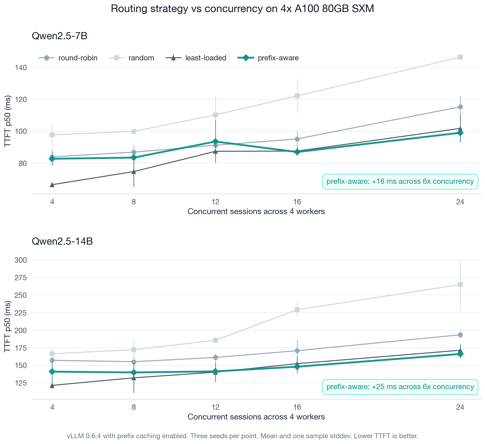
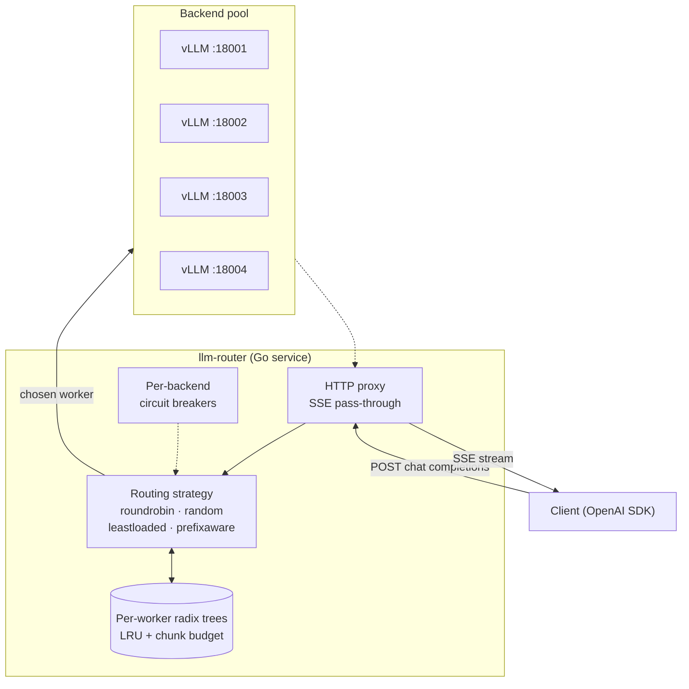

<div align="center">

# CacheRoute

**Cache-aware load balancer for OpenAI-compatible LLM servers, in Go.**

[](go.mod)
[](LICENSE)
[](https://github.com/zxuhan/llm-router/actions/workflows/ci.yml)
[](.github/workflows/ci.yml)
[](https://github.com/zxuhan/llm-router/stargazers)

</div>

CacheRoute sits in front of a pool of OpenAI-compatible inference servers
(vLLM, llama.cpp, mlx-lm, anything that speaks `/v1/chat/completions`) and
routes each chat completion to the worker that already holds its prefix in
KV cache. Skipping the prefill stage on cache hits keeps time-to-first-token
bounded as concurrency rises. The benchmark below was run on **4× A100 80GB
SXM with vLLM 0.6.4 and Qwen2.5 at two model sizes**, total cloud cost ~$25
to reproduce.

<p align="center">
  
</p>

## Quickstart

Local, against `llama-server`:

```bash
brew install llama.cpp

mkdir -p models
curl -L -o models/qwen2.5-1.5b.gguf \
  https://huggingface.co/Qwen/Qwen2.5-1.5B-Instruct-GGUF/resolve/main/qwen2.5-1.5b-instruct-q4_k_m.gguf

make build
MODEL=models/qwen2.5-1.5b.gguf WORKER_PORTS="8001 8002 8003" \
  RUNS=3 SESSIONS=6 TURNS=3 SYS_LEN=2048 SEED=17 \
  bash bench/scripts/real-llm.sh

cat bench/results/real.md
```

Cloud, on a fresh RunPod 4× A100 80GB SXM pod with 50 GB container disk:

```bash
git clone https://github.com/zxuhan/llm-router.git
cd llm-router
bash scripts/install-cloud.sh
tmux new -s bench
bash bench/scripts/full-bench.sh
# detach Ctrl+b d, reattach: tmux attach -t bench
```

The cloud runbook (preempt recovery, the terminate-vs-stop billing trap,
port-collision diagnostics, scp recipe): [`docs/cloud-bench.md`](docs/cloud-bench.md).

## Performance

> [!NOTE]
> Numbers are mean ± stddev across three seeds at each concurrency point.
> Trace shape: 12 to 24 sessions, 8 turns each, 6 KB shared system prompt,
> max_tokens=64. Three seeds is a small sample and a few intermediate
> points have visibly noisy error bars in the chart above; the headline
> is the slope, not any single point.

### Headline: TTFT slope under load (sessions=4 to sessions=24)

| Strategy | 7B slope | 14B slope |
| :--- | ---: | ---: |
| random            | +49 ms (97 to 146 ms) | +98 ms (167 to 265 ms) |
| round-robin       | +31 ms (84 to 115 ms) | +36 ms (157 to 193 ms) |
| least-loaded      | +36 ms (66 to 102 ms) | +49 ms (122 to 171 ms) |
| **prefix-aware**  | **+16 ms (83 to 99 ms)** | **+25 ms (141 to 166 ms)** |

Prefix-aware degrades 2 to 3 times more gently than every baseline at both
model sizes. The pattern is the same shape; absolute magnitudes scale with
prefill cost.

### Production-shape point (sessions=24, 14B, six sessions per worker)

| Strategy | KV cached | TTFT p50 | TTFT p95 | TTFT p99 | RPS |
| :--- | ---: | ---: | ---: | ---: | ---: |
| roundrobin   | 91.10% | 193 ms | 2.40 s | 2.72 s | 25.2 |
| random       | 90.69% | 265 ms | 2.36 s | 2.74 s | 23.4 |
| leastloaded  | 94.22% | 171 ms | 2.12 s | 2.29 s | 27.6 |
| **prefixaware** | **94.88%** | **166 ms** | **2.13 s** | **2.25 s** | 26.8 |

Prefix-aware wins p50 by 14% over round-robin and 37% over random, with the
lowest p99. Upstream KV cache hit rate stays at 94 to 95% across every
concurrency point on every model size; baselines drift between 80 and 95%.

### Where prefix-aware does not win

At one session per worker (`sessions=4`), `leastloaded` beats prefix-aware
by 17 to 19 ms on both models:

| Model | LL p50 | PA p50 | gap |
| :--- | ---: | ---: | ---: |
| Qwen2.5-7B  |  66 ms |  83 ms | LL +17 ms |
| Qwen2.5-14B | 122 ms | 141 ms | LL +19 ms |

With one session per worker, `leastloaded` accidentally distributes one
session per worker; the second turn naturally lands on the worker that
already cached turn one, so there is no need for prefix-aware logic. The
strategy's stricter pinning adds router overhead with no marginal benefit
at this regime. The crossover is around `sessions = N_workers + 1`; below
it, cheap baselines suffice; above it, prefix-aware leads.

> [!IMPORTANT]
> The benchmark is a single trace pattern (multi-turn conversations with a
> fixed-length shared system prompt). Real production traffic mixes
> single-turn, RAG, and branching tool loops. The crossover concurrency,
> the absolute TTFT numbers, and the cache hit rates will all shift with a
> different traffic shape; the relative ordering of strategies should hold.

Full per-concurrency tables for both models, with hit rates, RPS, and
caveats: [`docs/results-cloud.md`](docs/results-cloud.md).

## Architecture



Each backend has its own compressed radix tree of recently-dispatched
prompt prefixes, hashed into 32-byte chunks. On each request the router
asks every tree for the longest leading-chunk match, randomizes ties,
sorts by `(match desc, inflight asc)`, and applies a saturation safety
valve before dispatch. Every routing decision is exposed to the client via
`X-Router-Backend` and `X-Router-Reason` response headers.

| Strategy | Decision rule |
| :--- | :--- |
| `roundrobin` | rotation counter |
| `random` | uniform random |
| `leastloaded` | minimum in-flight count |
| `prefixaware` | longest prefix match across per-worker trees, ties broken by random shuffle, with a saturation valve that spills off any worker above `inflight ≥ saturation_inflight` |

Package layout, request lifecycle diagram, and the full list of emitted
Prometheus metrics: [`docs/architecture.md`](docs/architecture.md). Eight
ADRs covering language choice, backend abstraction, prefix tree design,
LRU eviction, the safety valve, tokenization, the circuit breaker, and
tie-break randomization: [`docs/decisions/`](docs/decisions/).

## Limitations

In rough order of impact if addressed:

- **Bootstrap CIs over the per-request distribution** would replace the
  current ±1 sample-stddev error bars (computed from three seeds). With
  only three seeds, an outlier seed visibly distorts a few intermediate
  points.
- **Tokenizer-backed chunker** would replace the current 32-byte hash
  chunks ([ADR 0006](docs/decisions/0006-tokenization-strategy.md)). Hash
  chunks are model-agnostic and cheap, but chunk boundaries can split
  tokens; a real tokenizer would tighten the longest-match calculation.
- **Auto-tuned `saturation_inflight`** based on observed per-worker p95
  latency would remove the only routing knob that needs manual setting
  per workload. Today's default of four is calibrated for our trace shape.
- **SGLang RadixAttention as an upstream baseline.** The current bench
  compares four routing strategies against the same vLLM upstream. A
  comparison against SGLang's engine-level cache-aware scheduling would
  separate the routing-layer contribution from the engine-layer one.
- **Multi-trace bench.** The current trace is one shape; real production
  mixes single-turn, RAG, and branching tool loops.
- **Half-open one-probe circuit breaker.** Today's breaker is closed and
  open with a fixed cooldown ([ADR 0007](docs/decisions/0007-circuit-breaker.md));
  a half-open probe would shorten recovery from a flaky backend.

## References

- **[SGLang: Efficient Execution of Structured Language Model Programs](https://arxiv.org/abs/2312.07104)** (Zheng et al., 2023). RadixAttention, the engine-level prefix caching this project demonstrates at the routing layer.
- **[Efficient Memory Management for Large Language Model Serving with PagedAttention](https://arxiv.org/abs/2309.06180)** (Kwon et al., 2023). The vLLM paper; the upstream whose prefix caching and `prompt_tokens_details.cached_tokens` we read from.
- **[Mooncake: A KVCache-centric Disaggregated Architecture for LLM Serving](https://arxiv.org/abs/2407.00079)** (Qin et al., 2024). Production-scale precedent for cache-aware request scheduling across an inference fleet.
