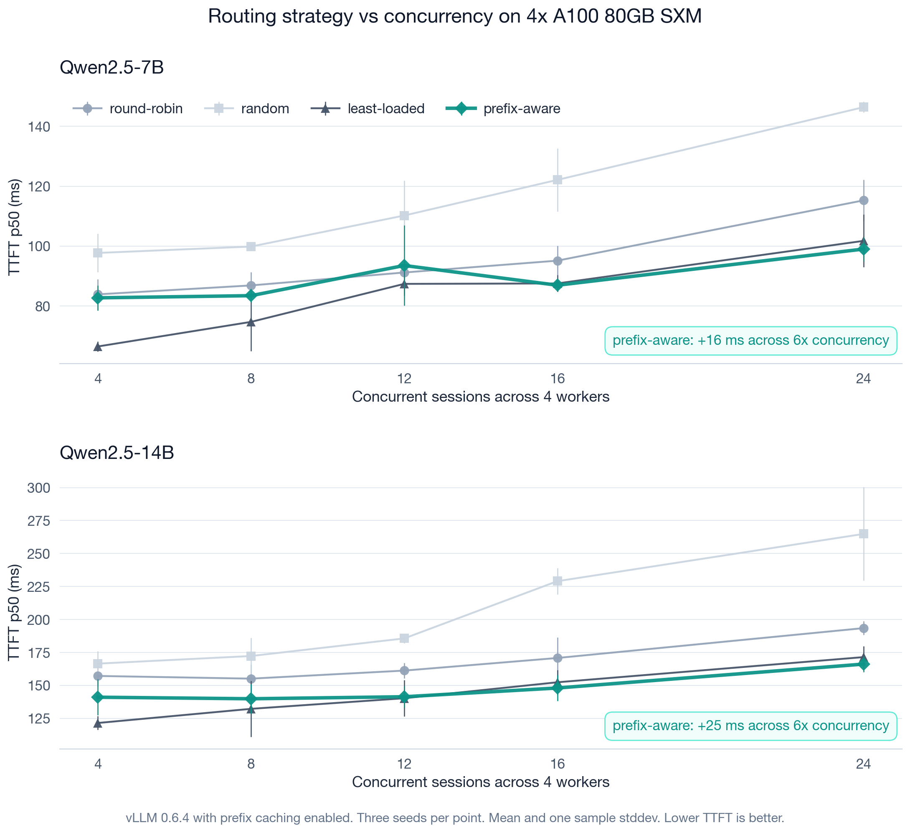
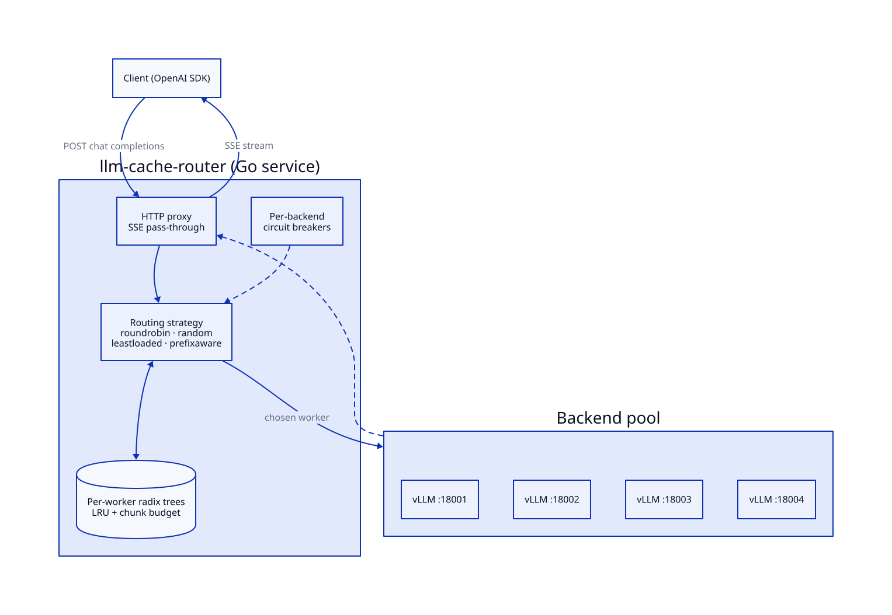

<div align="center">

# llm-cache-router

<p align="center">
  
  
  
  
  
</p>

<p>
  <strong>Cache-aware router for OpenAI-compatible LLM servers, in Go.</strong><br/>
  Routes each request to the worker that already holds its prefix in KV cache, so prefill runs once per shared prefix instead of once per worker. Validated locally with llama.cpp + Qwen2.5-1.5B, then run on 4× A100 80GB SXM with vLLM 0.6.4 + Qwen2.5-{7B,14B}. Cloud reproduction cost: ~$25.
</p>



</div>

## Performance

The hero chart above is the cloud sweep. Numbers below are mean ±
stddev across three seeds at each concurrency point. Trace shape: 4 to
24 sessions, 8 turns each, 6 KB shared system prompt, max_tokens=64.

> [!NOTE]
> Three seeds is a small sample and a few intermediate points have
> visibly noisy error bars in the chart. The headline is the slope, not
> any single point.

### Headline: TTFT slope under load (sessions=4 to sessions=24)

| Strategy | 7B slope | 14B slope |
| :--- | ---: | ---: |
| random            | +49 ms (98 to 146 ms) | +98 ms (167 to 265 ms) |
| round-robin       | +31 ms (84 to 115 ms) | +36 ms (157 to 194 ms) |
| least-loaded      | +35 ms (67 to 102 ms) | +50 ms (122 to 172 ms) |
| **prefix-aware**  | **+16 ms (83 to 99 ms)** | **+25 ms (141 to 166 ms)** |

Prefix-aware has the gentlest slope on both model sizes. Slope ratios
relative to PA: random 3.0× (7B) / 3.9× (14B); least-loaded 2.2× / 2.0×;
round-robin 1.9× / 1.4×.

### Production-shape point (sessions=24, 14B, six sessions per worker)

| Strategy | KV cached | TTFT p50 | TTFT p95 | TTFT p99 | RPS |
| :--- | ---: | ---: | ---: | ---: | ---: |
| roundrobin   | 91.10% | 193 ms | 2.40 s | 2.72 s | 25.2 |
| random       | 90.69% | 265 ms | 2.36 s | 2.74 s | 23.4 |
| leastloaded  | 94.22% | 171 ms | 2.12 s | 2.29 s | 27.6 |
| **prefixaware** | **94.88%** | **166 ms** | 2.13 s | **2.25 s** | 26.8 |

Prefix-aware wins p50 by 3% over the best baseline (`leastloaded`), 14%
over round-robin, and 37% over random; p95 is essentially tied with
`leastloaded` (2.13 s vs 2.12 s); p99 is the tightest of the four
(2.25 s vs 2.29 s LL, 2.72-2.74 s RR/random). Upstream KV cache hit rate
stays at 94-95% across every concurrency point on both model sizes;
baselines drift between 80% and 95% with load.

### Where prefix-aware does not win

Per-point p50 comparison between PA and the best baseline (always
least-loaded on this trace):

| sessions | 7B PA / LL p50 | winner | 14B PA / LL p50 | winner |
| ---: | :--- | :--- | :--- | :--- |
|  4 | 83 / 67 ms  | **LL +16 ms** | 141 / 122 ms | **LL +19 ms** |
|  8 | 84 / 75 ms  | **LL +9 ms**  | 140 / 132 ms | **LL +8 ms** |
| 12 | 94 / 87 ms  | **LL +7 ms**  | 141 / 140 ms | tied |
| 16 | 87 / 88 ms  | PA +1 ms      | 148 / 152 ms | **PA +4 ms** |
| 24 | 99 / 102 ms | **PA +3 ms**  | 166 / 172 ms | **PA +5 ms** |

PA's per-point p50 wins start at sessions=16 (4× the worker count), not
at sessions=`N_workers + 1`. Below that, `leastloaded` accidentally
distributes one session per worker and the second turn naturally lands
on the worker that cached turn one, so PA's stricter pinning adds
router overhead without marginal benefit. PA's value across the whole
range is the **flat slope** (see the headline table); the per-point p50
gap only opens up at high concurrency.

> [!IMPORTANT]
> The benchmark is a single trace pattern (multi-turn conversations with
> a fixed-length shared system prompt). Real production traffic mixes
> single-turn, RAG, and branching tool loops. The crossover concurrency,
> the absolute TTFT numbers, and the cache hit rates will all shift with
> a different traffic shape; the relative ordering of strategies should
> hold.

Full per-concurrency tables for both cloud models, with hit rates, RPS,
and caveats: [`docs/results-cloud.md`](docs/results-cloud.md).

### Local validation: same algorithm, smaller scale

The same Go code was validated on an M1 Pro against three `llama-server`
workers serving Qwen2.5-1.5B (Q4_K_M), three seeds, 18 requests each:

| Strategy | KV cached | TTFT p50 | TTFT p95 | RPS |
| :--- | ---: | ---: | ---: | ---: |
| roundrobin     | 57.56% | 2.01 s | 8.21 s | 1.67 |
| random         | 62.34% | 1.70 s | 8.06 s | 1.84 |
| leastloaded    | 61.94% | **0.82 s** | 8.29 s | 1.85 |
| **prefixaware** | **75.00%** | 2.10 s | **3.70 s** | **2.36** |

vs `leastloaded` (best baseline): +13.1 pp cache hit, **55% lower p95
TTFT**, 28% higher throughput. p50 favors `leastloaded` (0.82 s vs PA's
2.10 s) because PA pins subsequent requests onto the same worker
serially while `leastloaded` parallelises cold prefills across three.
The win is at the tail and on throughput, same shape as the cloud
result. Three-seed CIs, safety-valve ablation, smaller-model reference:
[`docs/results.md`](docs/results.md).

## Architecture



<!-- source: docs/diagrams/architecture.d2 — regenerate with `make diagrams` -->


Each backend has its own compressed radix tree of recently-dispatched
prompt prefixes, hashed into 32-byte chunks. On each request the router
asks every tree for the longest leading-chunk match, randomizes ties,
sorts by `(match desc, inflight asc)`, and applies a saturation safety
valve before dispatch. Every routing decision is exposed to the client
via `X-Router-Backend` and `X-Router-Reason` response headers.

| Strategy | Decision rule |
| :--- | :--- |
| `roundrobin` | rotation counter |
| `random` | uniform random |
| `leastloaded` | minimum in-flight count |
| `prefixaware` | longest prefix match across per-worker trees, ties broken by random shuffle, with a saturation valve that spills off any worker above `inflight ≥ saturation_inflight` |

### Relation to engine-level prefix caching (SGLang, vLLM)

SGLang's RadixAttention and vLLM's `--enable-prefix-caching` solve the
same problem one layer down: inside a single inference engine, sharing
cached prefixes across requests that the engine already received.
`llm-cache-router` solves it one layer up: deciding which of N
independent engine instances a request reaches in the first place, so
the request lands on the worker that already holds its prefix. The two
layers compose; run vLLM (or SGLang) behind this router and you get
both intra-engine prefix reuse and inter-worker cache locality, with
neither layer needing to know the other exists.

Package layout, request lifecycle diagram, and the full list of emitted
Prometheus metrics: [`docs/architecture.md`](docs/architecture.md).
Eight ADRs covering language choice, backend abstraction, prefix tree
design, LRU eviction, the safety valve, tokenization, the circuit
breaker, and tie-break randomization: [`docs/decisions/`](docs/decisions/).

## Quickstart

Two paths: a 15-minute local run on a Mac with no GPU, and a 3.5-hour
cloud run that produces the chart above.

**Local** (Apple Silicon, llama.cpp, Qwen2.5-1.5B):

```bash
brew install llama.cpp

mkdir -p models
curl -L -o models/qwen2.5-1.5b.gguf \
  https://huggingface.co/Qwen/Qwen2.5-1.5B-Instruct-GGUF/resolve/main/qwen2.5-1.5b-instruct-q4_k_m.gguf

make build
MODEL=models/qwen2.5-1.5b.gguf WORKER_PORTS="8001 8002 8003" \
  RUNS=3 SESSIONS=6 TURNS=3 SYS_LEN=2048 SEED=17 \
  bash scripts/bench/real-llm.sh

cat bench/results/real.md
```

Knobs and ablations: [`docs/benchmarks.md`](docs/benchmarks.md). Full
results: [`docs/results.md`](docs/results.md).

**Cloud** (RunPod 4× A100 80GB SXM, vLLM, Qwen2.5):

```bash
git clone https://github.com/zxuhan/llm-router.git
cd llm-router
bash scripts/install-cloud.sh
tmux new -s bench
bash scripts/bench/full-bench.sh
# detach Ctrl+b d, reattach: tmux attach -t bench
```

Pod sizing, scp recipe, preempt recovery, terminate-vs-stop billing
trap: [`docs/cloud-bench.md`](docs/cloud-bench.md).

## Project structure

```
.
├── cmd/                       CLI binaries: router, bench, gen-traces, replay
├── internal/                  Go packages: config, backend, prefixtree, router, proxy, ...
├── config/                    example yaml
├── scripts/
│   ├── install-cloud.sh       one-shot pod setup (Go + vLLM + pinned deps)
│   ├── bench/                 orchestrators: real-llm.sh, cloud-vllm.sh, full-bench.sh, ...
│   └── plot/                  matplotlib renderers: hero-cloud.py, sweep-plot.py, ...
├── docs/
│   ├── architecture.md        package graph, request lifecycle, metrics list
│   ├── benchmarks.md          local reproduction recipes
│   ├── cloud-bench.md         cloud reproduction runbook
│   ├── results.md             local M1 numbers
│   ├── results-cloud.md       cloud A100 numbers, per-concurrency tables
│   ├── decisions/             8 ADRs
│   └── images/                chart and gif assets
├── .github/workflows/ci.yml   vet, lint, race tests, coverage gate, fuzz smoke
├── Makefile
├── go.mod
└── README.md
```

## Limitations

- **Bootstrap CIs over the per-request distribution** would replace the
  current ±1 sample-stddev error bars (computed from three seeds). With
  only three seeds, an outlier seed visibly distorts a few intermediate
  points.
- **Tokenizer-backed chunker** would replace the current 32-byte hash
  chunks ([ADR 0006](docs/decisions/0006-tokenization-strategy.md)).
  Hash chunks are model-agnostic and cheap, but chunk boundaries can
  split tokens; a real tokenizer would tighten the longest-match
  calculation.
- **Auto-tuned `saturation_inflight`** based on observed per-worker p95
  latency would remove the only routing knob that needs manual setting
  per workload. The shipped default is eight; the cloud bench overrides
  it to four, calibrated for that trace shape.
- **SGLang as the upstream engine.** The Architecture section explains
  the composition; the cloud bench has not yet measured the layered
  combination of `llm-cache-router` + SGLang behind it. Doing so would
  quantify how much extra latency comes off when intra-engine and
  inter-worker cache locality are stacked.
- **Multi-trace bench.** The current trace is one shape; real production
  mixes single-turn, RAG, and branching tool loops.
- **Half-open one-probe circuit breaker.** Today's breaker is closed and
  open with a fixed cooldown ([ADR 0007](docs/decisions/0007-circuit-breaker.md));
  a half-open probe would shorten recovery from a flaky backend.

## References

- **[SGLang: Efficient Execution of Structured Language Model Programs](https://arxiv.org/abs/2312.07104)** (Zheng et al., 2023). RadixAttention, the engine-level prefix caching this project demonstrates at the routing layer.
- **[Efficient Memory Management for Large Language Model Serving with PagedAttention](https://arxiv.org/abs/2309.06180)** (Kwon et al., 2023). The vLLM paper; the upstream whose prefix caching and `prompt_tokens_details.cached_tokens` we read from.
- **[Mooncake: A KVCache-centric Disaggregated Architecture for LLM Serving](https://arxiv.org/abs/2407.00079)** (Qin et al., 2024). Production-scale precedent for cache-aware request scheduling across an inference fleet.
