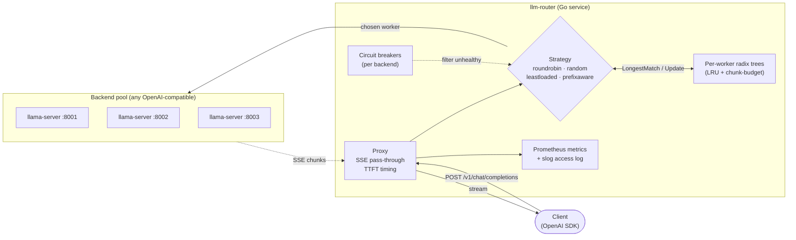
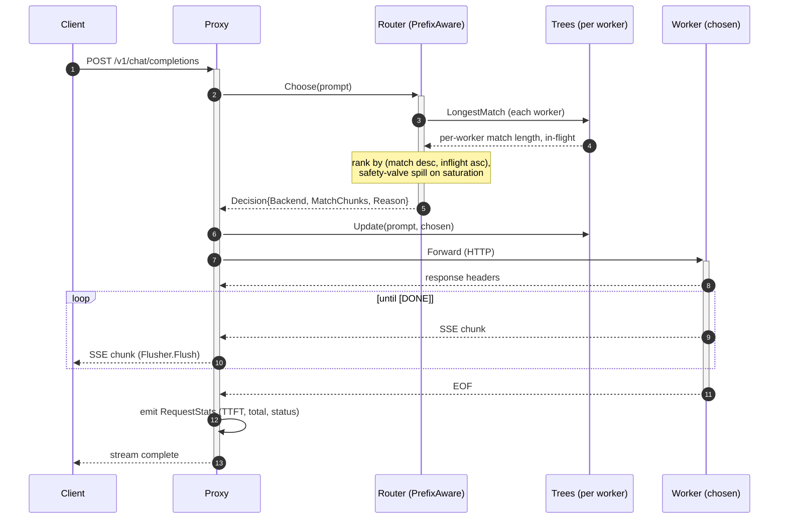

<!-- markdownlint-disable MD033 -->
<h1 align="center">llm-router</h1>

<p align="center">
  <strong>A prefix-cache aware reverse proxy for OpenAI-compatible LLM servers.</strong><br/>
  Routes each chat completion to the worker most likely to already hold the
  request's prefix in its KV cache, so prefill happens once per shared
  context, not once per request.
</p>

<p align="center">
  <a href="go.mod"></a>
  <a href="LICENSE"></a>
  
  
  
  
  
</p>

<p align="center">
  <a href="https://arxiv.org/abs/2312.07104"></a>
  
  
</p>

<p align="center">
  
</p>

---

## What it does, in one breath

Three identical `llama-server` workers; same trace; only the router differs.
The prefix-aware strategy realises a **57% lower mean p95 TTFT** with
**~10x tighter variance** by keeping shared system prompts on whichever
worker first warmed them, instead of fanning every request out blindly.
On a real `llama.cpp` fleet, with real KV-cache numbers reported by
`prompt_tokens_details.cached_tokens`. Numbers are mean ± stddev across
3 seeds, fresh workers per (strategy, run).

| Strategy | Hit rate | KV cached | TTFT p50 | **TTFT p95** | RPS |
| --- | ---: | ---: | ---: | ---: | ---: |
| roundrobin | 0.00% | 58.53 ± 0.30% | 1.88 s ± 317 ms | 7.54 s ± 263 ms | 1.87 ± 0.03 |
| random | 0.00% | 60.68 ± 6.58% | 2.48 s ± 795 ms | 5.87 s ± 926 ms | 1.96 ± 0.26 |
| leastloaded | 0.00% | 62.51 ± 0.56% | 0.75 s ± 256 ms | 6.77 s ± 1.32 s | 2.29 ± 0.47 |
| **prefixaware** | **94.44%** | **74.97 ± 1.21%** | 1.92 s ± 146 ms | **3.23 s ± 121 ms** | **2.60 ± 0.15** |

Full methodology, ablations, scaling math, and saturation-regime analysis:
[docs/results.md](docs/results.md). The hardware ceiling on these numbers
is a single Apple M1 Pro with 16 GB shared memory.

---

## Demo

<p align="center">
  
</p>

One command. Three strategies × three seeds. Fresh workers per run so
KV caches start empty. Aggregated to mean ± stddev with a per-run breakdown.

---

## Architecture



Routing strategies are pluggable behind a 3-method interface. The proxy
and backends are unaware of which strategy is in use.

| Strategy | Picks based on | When to use |
| --- | --- | --- |
| `roundrobin` | rotation counter | baseline |
| `random` | uniform random | baseline; avoids lock-step coupling |
| `leastloaded` | min in-flight | reacts to load, ignores prefix |
| **`prefixaware`** | longest prefix match per worker, with a saturation safety valve | the headline strategy |

Deeper dive: [docs/architecture.md](docs/architecture.md).

---

## How a single request flows



The `Update` happens *before* dispatch on purpose: near-simultaneous
requests with the same prefix all see the same "this worker now holds
it" hint and pin to the same worker. The cost of being wrong (dispatch
fails) is one cold start at worst. See [ADR 0005](docs/decisions/0005-safety-valve.md)
for the trade-off.

---

## Quickstart

```bash
brew install llama.cpp                                # one-time
mkdir -p models && curl -L -o models/qwen2.5-1.5b.gguf \
  https://huggingface.co/Qwen/Qwen2.5-1.5B-Instruct-GGUF/resolve/main/qwen2.5-1.5b-instruct-q4_k_m.gguf

make build

# canonical headline run (3 seeds, fresh workers per run, ~15 min)
MODEL=models/qwen2.5-1.5b.gguf \
  WORKER_PORTS="8001 8002 8003" \
  RUNS=3 SESSIONS=6 TURNS=3 SYS_LEN=2048 SEED=17 \
  bash bench/scripts/real-llm.sh

$EDITOR bench/results/real.md
```

For an in-process bench against fake backends (no `llama-server`,
no model file), just `bash bench/scripts/run.sh`. The hit-rate
comparison is the algorithmic signal even without real KV caches.

Full reproduction recipe (multi-seed mode, ablation, real-LLM gotchas):
[docs/benchmarks.md](docs/benchmarks.md).

---

## Why these numbers transfer to bigger models

Per-request prefill time is `prompt_tokens × per_token_prefill_time`. The
only thing the router can change is the *fraction* of tokens already
cached upstream. We measure that fraction lifting from ~59% to ~75% on
identical traffic, a ~16 pp lift that comes from routing decisions, not
hardware.

| Model / hardware | Cold prefill (500-token prompt) | Warm prefill (75% cached) | **Per-request savings** |
| --- | ---: | ---: | ---: |
| Qwen2.5-1.5B / M1 Pro (measured) | ~3.5 s prefill share of TTFT | ~1.0 s | **~2.5 s** |
| Llama-70B / 1× H100 (back-of-envelope) | ~500 ms | ~125 ms | **~375 ms** |
| Larger model / multi-GPU (extrapolation) | scales linearly with parameters | (1 - 0.75) × cold | **75% reduction at the prefill stage** |

The cached fraction is purely algorithmic. The *value* of that fraction
scales with model size. That is the property a production fleet
inherits without re-tuning.

---

## Engineering bar

| Property | Value | Where |
| --- | --- | --- |
| Test coverage (per `internal/` package) | **96.4%-100%** | `make cover` |
| Race-clean (`go test -race`) | **passing** | CI step `test` |
| Lint (`golangci-lint v2.1`) | **0 issues** | `make lint` |
| Fuzz-tested invariants | yes (radix tree vs brute-force oracle, 3 targets) | `internal/prefixtree/fuzz_test.go` |
| Concurrent safety | RWMutex + atomic counters; race + concurrent benches | `internal/router/bench_test.go` |
| Routing decision overhead | **8 ns / 0 allocs** (round-robin n=2); 1.5 µs (prefix-aware n=4 medium) | [docs/benchmarks.md](docs/benchmarks.md#routing-overhead-microbenchmark) |
| Backend resilience | per-backend circuit breaker, 5xx/transport trips it | [ADR 0007](docs/decisions/0007-circuit-breaker.md) |
| Observability | Prometheus (12 metrics), structured `slog` access log, request IDs | `internal/metrics/`, `internal/logging/` |
| CI gate | vet · staticcheck · golangci-lint · race · 90% coverage threshold · 60 s fuzz smoke | [.github/workflows/ci.yml](.github/workflows/ci.yml) |
| Architectural decisions documented | 7 ADRs | [docs/decisions/](docs/decisions/) |

---

## Repository tour

```text
cmd/
  router/        OpenAI-compatible proxy (the long-running service)
  bench/         in-process or real-LLM benchmark across all 4 strategies
  gen-traces/    deterministic synthetic agent trace generator (JSONL)
  replay/        concurrent trace replayer with realistic per-session timing

internal/
  config/        yaml + env config, strict validation
  backend/       Backend interface, llama.cpp client, fake server, circuit breaker
  prefixtree/    concurrent radix tree with LRU eviction (fuzz-tested)
  router/        Router interface + 4 strategies + chunker + microbenchmarks
  proxy/         HTTP handler: prompt extract → route → dispatch → stream → observe
  metrics/       Prometheus registry + Recorder adapter + tree collector
  logging/       slog wrapper, request IDs, AccessLogRecorder
  trace/         trace generator, replayer, summary report writer
  integration/   end-to-end tests across the whole stack

docs/
  architecture.md     deeper architecture (sequence diagrams, package graph)
  results.md          full benchmark results: multi-seed CIs, ablation, saturation
  benchmarks.md       reproduction recipes (in-process + real-LLM)
  cdf.png             pooled latency CDF (54 samples / strategy)
  hero.png            README hero image
  decisions/          7 ADRs (Go vs Rust, llama.cpp, radix tree, eviction,
                      safety valve, tokenization, circuit breaker)

bench/scripts/
  run.sh              in-process bench (fake backends, no external deps)
  real-llm.sh         real-LLM orchestrator (boots llama-server, fresh per run)
  ablate-saturation.sh  safety-valve threshold sweep
  plot.py             matplotlib CDF renderer
  hero.py             matplotlib hero image renderer
  aggregate.go        merge per-strategy summaries into one Markdown report
```

---

## Deeper reading

- **[docs/architecture.md](docs/architecture.md)**: package graph, sequence
  diagrams, concurrency model, metrics list.
- **[docs/results.md](docs/results.md)**: multi-seed headline, safety-valve
  ablation, saturation regime, smaller-model reference, fake-backend
  isolation, scaling math. Everything an inquiring reviewer would ask.
- **[docs/benchmarks.md](docs/benchmarks.md)**: full reproduction recipes
  (env vars, reset semantics, plot rendering).
- **[docs/decisions/](docs/decisions/)**: 7 ADRs covering language,
  backend, tree, eviction, safety valve, tokenization, breaker.

---

## Future work

In rough order of impact, things I know are still missing:

- **Bootstrap CIs over the empirical CDF** instead of mean ± stddev
  across 3 seeds. Would tighten the uncertainty on tail percentiles
  specifically.
- **Tokenizer-backed chunker.** Hash-of-bytes is correct but coarse.
  ADR 0006 documents the trade-off.
- **Half-open one-probe circuit breaker.** Current breaker is
  closed → open → closed; adding a probe state would shed less
  traffic during recovery. ADR 0007 explains the simplification.
- **Admin endpoint for draining.** `POST /admin/drain?backend=w0`,
  trivial on top of the existing health gate.
- **vLLM and mlx-lm constructors as first-class backends.** The
  Backend interface is small enough to make this a one-file change;
  only `llama.cpp` is exercised in the committed tests.
- **Grafana dashboard JSON.** Metrics are emitted; one-screen
  dashboard would make them legible at a glance.
- **Sticky-session affinity for non-prefix routers.** Even round-robin
  could pin within a session for free; the trace generator already
  carries SessionID for this.

---

## License

MIT. See [LICENSE](LICENSE).

## References

- [SGLang RadixAttention](https://arxiv.org/abs/2312.07104): the
  upstream technique this project demonstrates at the routing layer.
- [vLLM automatic prefix caching](https://docs.vllm.ai/en/latest/automatic_prefix_caching/apc.html)
- [llama.cpp server prompt cache](https://github.com/ggerganov/llama.cpp/tree/master/examples/server)
