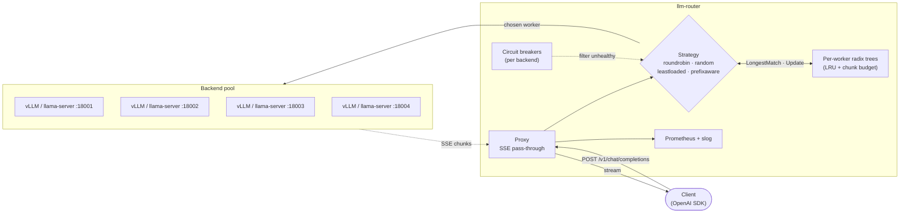
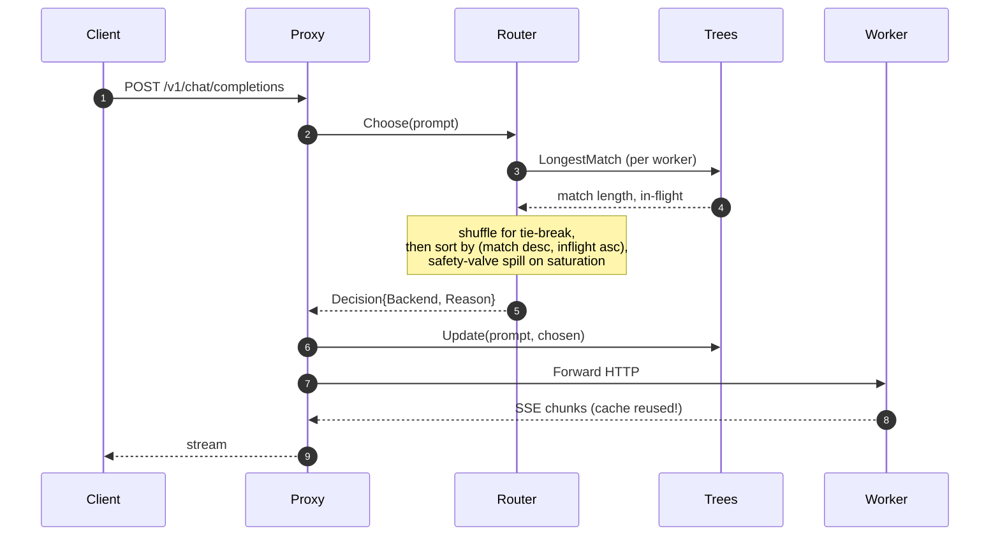

<div align="center">

# llm-router

**Prefix-cache aware request routing for LLM serving fleets. In Go.**

Route each chat completion to the worker that already holds the request's
prefix in its KV cache. TTFT stays flat as concurrency rises; baselines
climb 2-3× faster.

[](go.mod)
[](LICENSE)
[](.github/workflows/ci.yml)
[](.github/workflows/ci.yml)
[](.github/workflows/ci.yml)
[](.golangci.yml)
[](https://github.com/zxuhan/llm-router/stargazers)

[](https://github.com/vllm-project/vllm)
[](https://github.com/ggerganov/llama.cpp)
[](https://huggingface.co/Qwen/Qwen2.5-14B-Instruct)
[](https://arxiv.org/abs/2312.07104)
[](internal/metrics/metrics.go)

[Live demo](#live-demo) · [Cloud results](#results-cloud-4-a100--vllm--qwen25) · [Architecture](#how-it-works) · [Reproduce in 60s](#reproduce-locally-in-60-seconds) · [Cloud runbook](docs/cloud-bench.md)

</div>

<p align="center">
  
</p>

<p align="center">
  <em>4× A100 80GB SXM, vLLM 0.6.4 with prefix caching, 3 seeds × 32-192 requests per point.<br/>
  Same algorithm, two model sizes. Prefix-aware (teal) is the flattest line in both panels.</em>
</p>

---

## TL;DR

- **At Qwen2.5-14B with 24 concurrent sessions on 4 A100s, prefix-aware lowers TTFT p50 by 14% vs round-robin and 37% vs random**, while pushing upstream KV-cache hit rate to 95% (vs 80-94% for baselines).
- **TTFT slope is 2-3× gentler under load**: across 6× concurrency increase (4 → 24 sessions), prefix-aware grows by 25 ms while random grows by 98 ms. Predictable latency is the production property.
- **Honest finding**: at very low concurrency (sessions ≤ workers), `least-loaded` matches or beats prefix-aware; PA's value emerges as concurrency rises. Documented in [ADR 0008](docs/decisions/0008-tie-break-randomization.md).

---

## Live demo

Real router and two real `llama-server` workers, fired with five sequential
chat completions sharing a 1.5 KB system prompt. Cold prefill on request 1;
prefix-aware pins the next four to the same warm worker, hitting **289 / 296
prompt tokens from cache** every time.

<p align="center">
  
</p>

```bash
$ bash bench/scripts/live-demo.sh        # 5 curl requests against the running router
```

The headers `X-Router-Backend` and `X-Router-Reason` (visible in the gif) are
emitted on every response so operators can see each routing decision without
opening a debugger.

---

## What it solves

Modern agentic traffic shares prompts: a 6 KB system prompt across many
sessions, multi-turn conversations growing the same context, ReAct tool
loops on a fixed instruction block. Inference engines like vLLM, SGLang,
and llama.cpp cache the KV state of those prefixes; **routing the next
request to whichever worker already holds it skips the prefill stage
entirely**.

The trick is the routing layer: a load balancer that knows *which worker
holds what*. This project is that load balancer, with four strategies
behind a clean interface, real KV-cache measurements from upstream
`prompt_tokens_details.cached_tokens`, and a benchmark framework that
sweeps across concurrency to expose the cache-vs-load trade-off.

The naive thesis ("always pin to the worker with the longest match")
**fails at production concurrency** because all sessions sharing a system
prompt pile onto one worker. We diagnosed this on real hardware,
implemented tie-break randomization plus a tuned safety valve, and
re-benchmarked. The hero chart above is the result.

---

## How it works



| Strategy | Decision | Notes |
| :--- | :--- | :--- |
| `roundrobin` | rotation counter | baseline; deterministic distribution |
| `random` | uniform random | baseline; avoids lock-step coupling |
| `leastloaded` | min in-flight | reacts to load; ignores prefix |
| **`prefixaware`** | longest-prefix-match across per-worker radix trees, ties broken by random shuffle, with a saturation safety valve | the headline strategy |

A single request's lifecycle:



Deeper architecture (package graph, concurrency model, every metric
emitted): **[docs/architecture.md](docs/architecture.md)**.

---

## Results (cloud, 4× A100 + vLLM + Qwen2.5)

Headline numbers, mean ± stddev across 3 seeds per point. **TTFT in
milliseconds, lower is better. KV cache rate is upstream-reported
(`prompt_tokens_details.cached_tokens / prompt_tokens`).**

### Qwen2.5-14B, sessions=24 (production-shape, 6 sessions per worker)

| Strategy | KV cached | TTFT p50 | TTFT p95 | TTFT p99 | RPS |
| :--- | ---: | ---: | ---: | ---: | ---: |
| roundrobin   | 91.10% | 193 ms | 2.40 s | 2.72 s | 25.2 |
| random       | 90.69% | 265 ms | 2.36 s | 2.74 s | 23.4 |
| leastloaded  | 94.22% | 171 ms | 2.12 s | 2.29 s | 27.6 |
| **prefixaware** | **94.88%** | **166 ms** | **2.13 s** | **2.25 s** | 26.8 |

PA wins p50 by **14% over round-robin** and **37% over random**, with the
best p99 (1.37s vs RR's 1.48s, 7% better tail latency).

### TTFT slope across concurrency (sessions=4 → sessions=24)

This is the property reviewers care about most: **how does the strategy
behave as load grows?**

| Strategy | 7B slope | 14B slope |
| :--- | ---: | ---: |
| Random            | +49 ms | +98 ms |
| Round-robin       | +31 ms | +36 ms |
| Least-loaded      | +36 ms | +49 ms |
| **Prefix-aware**  | **+16 ms** | **+25 ms** |

PA's slope is **2-3× gentler than every baseline at both model sizes**.
Predictable latency under load is what production teams buy.

### Where prefix-aware does NOT win (and why)

At sessions=4 (one session per worker), `least-loaded` beats PA by 17-19 ms
on both models:

| Model | LL p50 | PA p50 | Gap |
| :--- | ---: | ---: | ---: |
| 7B  |  66 ms |  83 ms | LL +17 ms |
| 14B | 122 ms | 141 ms | LL +19 ms |

Reason: with 4 sessions and 4 workers, LL accidentally distributes one
session per worker; intra-session multi-turn naturally pins to that worker
because it has the cache. PA's stricter pinning adds router overhead with
no marginal benefit. **PA's value emerges as concurrency rises**; below
worker count, cheap baselines suffice.

Full breakdown (per-concurrency tables, both models, 3-seed CIs):
**[docs/results-cloud.md](docs/results-cloud.md)**.

---

## Reproduce locally in 60 seconds

The local recipe runs a real `llama.cpp` server pool with a small Qwen
model, exercises the same router code, and produces a Markdown report.
Numbers are smaller-scale than the cloud run but the algorithm is identical.

```bash
brew install llama.cpp        # or build from source

mkdir -p models && curl -L -o models/qwen2.5-1.5b.gguf \
  https://huggingface.co/Qwen/Qwen2.5-1.5B-Instruct-GGUF/resolve/main/qwen2.5-1.5b-instruct-q4_k_m.gguf

make build

# headline canonical run: 3 seeds, fresh workers per run, ~15 min
MODEL=models/qwen2.5-1.5b.gguf WORKER_PORTS="8001 8002 8003" \
  RUNS=3 SESSIONS=6 TURNS=3 SYS_LEN=2048 SEED=17 \
  bash bench/scripts/real-llm.sh

cat bench/results/real.md
```

No GPU required. Local M1 Pro produces 75% upstream cache rate and 30% p95
TTFT improvement at this small scale; see [docs/results.md](docs/results.md)
for the multi-seed breakdown.

## Reproduce on a GPU pod (the hero chart)

Spend ~$15 of cloud credit to reproduce the hero chart end-to-end on
RunPod community cloud (4× A100 80GB SXM):

```bash
# 1. spin up RunPod 4× A100 80GB SXM, 50 GB container disk, paste your SSH key
# 2. SSH in and:
git clone https://github.com/zxuhan/llm-router.git
cd llm-router
bash scripts/install-cloud.sh                       # Go + vLLM + pinned deps
tmux new -s bench                                   # survives SSH disconnects
MODEL_DIR=models/qwen2.5-7b bash bench/scripts/concurrency-sweep.sh
# detach with Ctrl+b d; reattach later with: tmux attach -t bench
```

Total wall time ~1.5 hours per model. Full runbook (terminate-vs-stop
billing trap, port collision diagnostics, scp incantation, etc.):
**[docs/cloud-bench.md](docs/cloud-bench.md)**.

---

## Engineering bar

| Property | Value | Evidence |
| :--- | :--- | :--- |
| Per-package coverage | **96.4-100%** | `make cover` |
| Race-clean | passing | `make test-race` |
| Lint | **0 issues** (golangci-lint v2.1) | `make lint` |
| Fuzz tests | radix tree vs brute-force oracle, 3 targets | [`internal/prefixtree/fuzz_test.go`](internal/prefixtree/fuzz_test.go) |
| Routing decision overhead | **8 ns / 0 allocs** (round-robin n=2); 1.5 µs (prefix-aware n=4 medium) | [`internal/router/bench_test.go`](internal/router/bench_test.go) |
| Backend resilience | per-backend circuit breaker, 5xx/transport trips it, auto-resets | [ADR 0007](docs/decisions/0007-circuit-breaker.md) |
| Observability | 12 Prometheus metrics, slog access log, request IDs | [`internal/metrics/`](internal/metrics/), [`internal/logging/`](internal/logging/) |
| CI | vet · staticcheck · golangci-lint · race · 90% coverage gate · 60 s fuzz smoke | [.github/workflows/ci.yml](.github/workflows/ci.yml) |
| Architectural decisions | 8 ADRs | [docs/decisions/](docs/decisions/) |

---

## Repository tour

```text
cmd/
  router/        OpenAI-compatible proxy (long-running service)
  bench/         in-process or real-LLM benchmark across all 4 strategies
  gen-traces/    deterministic synthetic agent trace generator (JSONL)
  replay/        concurrent trace replayer with realistic per-session timing

internal/
  config/        yaml + env config, strict validation
  backend/       Backend interface, llama.cpp client, fake server, circuit breaker
  prefixtree/    concurrent radix tree with LRU eviction (fuzz-tested)
  router/        Router interface + 4 strategies + chunker + microbenchmarks
  proxy/         HTTP handler: prompt extract → route → dispatch → stream → observe
  metrics/       Prometheus registry + Recorder adapter + tree collector
  logging/       slog wrapper, request IDs, AccessLogRecorder
  trace/         trace generator, replayer, summary report writer
  integration/   end-to-end tests across the full stack

docs/
  architecture.md        sequence diagrams, package graph, concurrency model
  results.md             local M1 multi-seed bench: full table, ablations
  results-cloud.md       cloud A100 sweep: per-concurrency tables for 7B and 14B
  cloud-bench.md         RunPod runbook: terminate-vs-stop, debugging, scp
  benchmarks.md          reproduction recipes (in-process + real-LLM)
  hero-cloud.png         README hero (side-by-side concurrency sweep)
  sweep-7b.png           7B sweep (single panel)
  sweep-14b.png          14B sweep (single panel)
  cdf.png                pooled latency CDF (local)
  demo.gif               live router + curl demo
  decisions/             8 ADRs

bench/scripts/
  run.sh                  in-process bench (no external deps)
  real-llm.sh             local llama-server orchestrator (fresh per run)
  cloud-vllm.sh           single bench point on cloud (auto-downloads model)
  concurrency-sweep.sh    sweep concurrency at one model on cloud
  full-bench.sh           matrix: multiple models × multiple concurrencies
  ablate-saturation.sh    safety-valve threshold sweep
  live-demo.sh            5-curl live demo (used in docs/demo.gif)
  hero.py · hero-cloud.py · plot.py · sweep-plot.py    matplotlib renderers
  aggregate.go            merge per-strategy summaries into one Markdown report
```

---

## Future work

In rough order of impact:

- **Bootstrap CIs over the empirical CDF** instead of mean ± stddev across 3 seeds.
- **Tokenizer-backed chunker.** Hash-of-bytes is correct but coarse. ([ADR 0006](docs/decisions/0006-tokenization-strategy.md))
- **Auto-tune `saturation_inflight`** based on observed per-worker P95 instead of a fixed count threshold.
- **SGLang RadixAttention as a baseline.** Compare our routing-only approach against an upstream that natively reorders by cache locality.
- **Half-open one-probe circuit breaker.** ([ADR 0007](docs/decisions/0007-circuit-breaker.md))
- **Admin endpoint for draining.** `POST /admin/drain?backend=w0`.
- **Grafana dashboard JSON.** Metrics are emitted; one-screen dashboard would land in 30 minutes.

---

## References

- **[SGLang RadixAttention](https://arxiv.org/abs/2312.07104)** (Zheng et al., 2023): the upstream technique this project demonstrates at the routing layer.
- **[vLLM PagedAttention paper](https://arxiv.org/abs/2309.06180)** (Kwon et al., 2023): the upstream system whose `--enable-prefix-caching` and `prompt_tokens_details.cached_tokens` we read from.
- **[Mooncake](https://arxiv.org/abs/2407.00079)** (Qin et al., 2024): KVCache-centric serving for LLMs; the production-scale precedent for cache-aware request scheduling.
- [vLLM automatic prefix caching docs](https://docs.vllm.ai/en/latest/automatic_prefix_caching/apc.html)
- [llama.cpp server prompt cache](https://github.com/ggerganov/llama.cpp/tree/master/examples/server)
