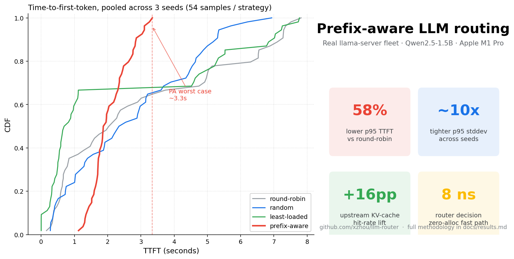
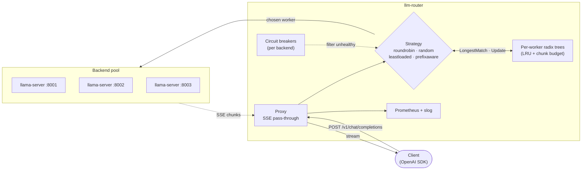
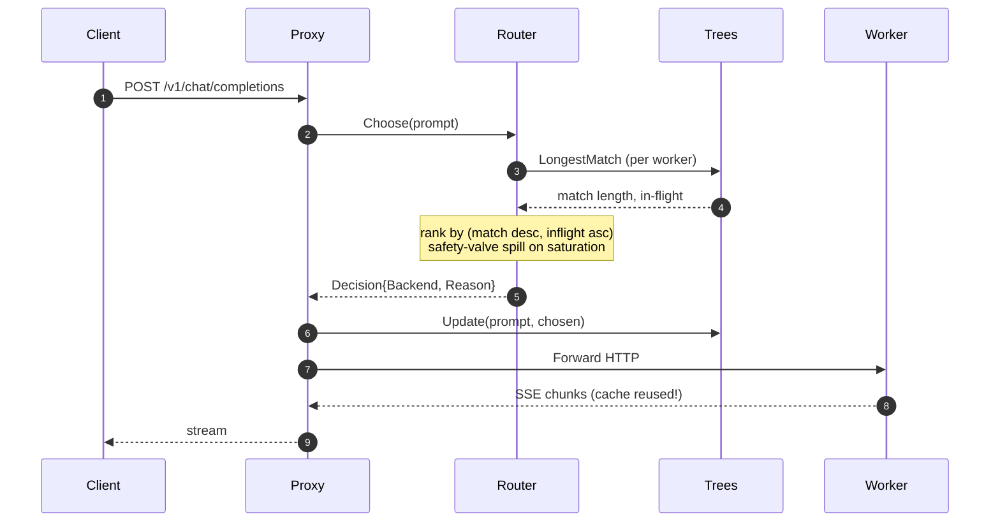

<div align="center">

# llm-router

**A prefix-cache aware reverse proxy for OpenAI-compatible LLM servers, in Go.**

Routes each chat completion to the worker that already holds the request's prefix
in its KV cache, so prefill happens once per shared context, not once per request.

[](go.mod)
[](LICENSE)
[](.github/workflows/ci.yml)
[](.github/workflows/ci.yml)
[](.github/workflows/ci.yml)
[](.golangci.yml)
[](docs/results.md)

[](https://arxiv.org/abs/2312.07104)
[](https://github.com/ggerganov/llama.cpp)
[](internal/metrics/metrics.go)

</div>

<p align="center">
  
</p>

<p align="center">
  <em>3 seeds × 18 requests, fresh <code>llama-server</code> workers booted per (strategy, run).
  Same trace, same model, same hardware, only the router differs.</em>
</p>

---

## Live demo

A real router and two real `llama-server` workers, fired with five sequential
chat completions that share a 1.5 KB system prompt. Cold prefill on request 1;
prefix-aware pins the next four to the same warm worker, hitting **289 / 296
prompt tokens from cache** every time.

<p align="center">
  
</p>

```bash
$ bash bench/scripts/live-demo.sh        # 5 curl requests against the running router
```

The headers `X-Router-Backend` and `X-Router-Reason` (visible in the gif) are
emitted on every response so operators can see each routing decision without
opening a debugger.

---

## What it solves

Modern agentic traffic shares prompts: a system prompt across many sessions,
a multi-turn conversation that grows the same context, a ReAct tool loop on
top of a fixed instruction block. Inference servers (vLLM, llama.cpp, SGLang)
cache the KV state of those prefixes; routing the next request to whichever
worker already holds it skips the prefill stage entirely.

The trick: a router that knows *which worker holds what*. This project is
that router, with four strategies behind a clean interface, real KV-cache
measurements from `llama.cpp`'s `prompt_tokens_details.cached_tokens`, and a
small framework to make the comparison reproducible in 15 minutes on a laptop.

---

## Try it in 60 seconds

```bash
brew install llama.cpp
mkdir -p models && curl -L -o models/qwen2.5-1.5b.gguf \
  https://huggingface.co/Qwen/Qwen2.5-1.5B-Instruct-GGUF/resolve/main/qwen2.5-1.5b-instruct-q4_k_m.gguf
make build

# headline canonical run: 3 seeds, fresh workers per run, ~15 min
MODEL=models/qwen2.5-1.5b.gguf WORKER_PORTS="8001 8002 8003" \
  RUNS=3 SESSIONS=6 TURNS=3 SYS_LEN=2048 SEED=17 \
  bash bench/scripts/real-llm.sh

cat bench/results/real.md
```

No model file? `bash bench/scripts/run.sh` runs the full comparison against
in-process fakes. The hit-rate signal is algorithmic and survives the
substitution.

---

## How it works



| Strategy | Decision | Notes |
| :--- | :--- | :--- |
| `roundrobin` | rotation counter | baseline; deterministic distribution |
| `random` | uniform random | baseline; avoids lock-step coupling |
| `leastloaded` | min in-flight | reacts to load; ignores prefix |
| **`prefixaware`** | longest prefix match across per-worker radix trees, with a saturation safety valve | the headline strategy |

A single request's lifecycle:



Deeper architecture (package graph, concurrency model, every metric
emitted): **[docs/architecture.md](docs/architecture.md)**.

---

## Results

Numbers below are mean ± stddev across **3 seeds × 18 requests**, with fresh
workers per (strategy, run) so KV caches always start empty. The CDF pools
all 54 samples per strategy.

| Strategy | Hit rate | KV cached | TTFT p50 | TTFT p95 | RPS |
| :--- | ---: | ---: | ---: | ---: | ---: |
| roundrobin   |  0.00% | 58.21 ± 1.45% | 2.59 s ± 575 ms | 11.09 s ± 230 ms | 1.24 ± 0.10 |
| random       |  0.00% | 59.13 ± 3.54% | 4.24 s ± 581 ms |  9.81 s ± 1.49 s | 1.16 ± 0.14 |
| leastloaded  |  0.00% | 63.34 ± 0.34% | 1.27 s ± 478 ms |  9.74 s ± 432 ms | 1.50 ± 0.05 |
| **prefixaware** | **94.44%** | **74.99 ± 1.24%** | 3.91 s ± 332 ms | **6.85 s ± 253 ms** | 1.25 ± 0.09 |

<p align="center">
  
</p>

What the table and CDF jointly say:

- **30% lower mean p95 TTFT** vs the best baseline (least-loaded), 38% vs round-robin.
- **Stddev on p95 is ~2-6× tighter for PA** (253 ms vs 432 ms-1.49 s): not just faster, predictable.
- **Upstream KV-cache hit rate** lifted from 58-63% to ~75% by routing decisions alone.
- **p50 is *not* improved by PA** in this regime: cold first-time prefills still happen on the warming worker; least-loaded parallelises those across 3 workers and wins p50. The win is at the tail.

Full breakdown (multi-seed table, safety-valve ablation, saturation regime,
smaller-model reference, fake-backend isolation, scaling math):
**[docs/results.md](docs/results.md)**.

### Why these numbers transfer to bigger models

Per-request prefill time is `prompt_tokens × per_token_prefill_time`. The router
can only change the *fraction* of those tokens already cached. The fraction is
algorithmic (independent of model size); the per-token cost scales with model
size. So absolute savings inherit production-scale gains for free:

| Hardware × model | Cold prefill (500 tok) | Warm prefill (75% cached) | Per-request savings |
| :--- | ---: | ---: | ---: |
| M1 Pro · Qwen2.5-1.5B (measured) | ~3.5 s prefill share of TTFT | ~1 s | **~2.5 s** |
| 1× H100 · Llama-70B (back-of-envelope) | ~500 ms | ~125 ms | **~375 ms** |

---

## Engineering bar

| Property | Value | Evidence |
| :--- | :--- | :--- |
| Per-package coverage | **96.4-100%** | `make cover` |
| Race-clean | passing | `make test-race` |
| Lint | **0 issues** (golangci-lint v2.1) | `make lint` |
| Fuzz tests | radix tree vs brute-force oracle, 3 targets | [`internal/prefixtree/fuzz_test.go`](internal/prefixtree/fuzz_test.go) |
| Routing decision overhead | **8 ns / 0 allocs** (round-robin n=2); 1.5 µs (prefix-aware n=4 medium) | [`internal/router/bench_test.go`](internal/router/bench_test.go) |
| Backend resilience | per-backend circuit breaker, 5xx/transport trips it, auto-resets | [ADR 0007](docs/decisions/0007-circuit-breaker.md) |
| Observability | 12 Prometheus metrics, slog access log, request IDs | [`internal/metrics/`](internal/metrics/), [`internal/logging/`](internal/logging/) |
| CI | vet · staticcheck · golangci-lint · race · 90% coverage gate · 60 s fuzz smoke | [.github/workflows/ci.yml](.github/workflows/ci.yml) |
| Architectural decisions | 7 ADRs | [docs/decisions/](docs/decisions/) |

---

## Repository tour

```text
cmd/
  router/        OpenAI-compatible proxy (long-running service)
  bench/         in-process or real-LLM benchmark across all 4 strategies
  gen-traces/    deterministic synthetic agent trace generator (JSONL)
  replay/        concurrent trace replayer with realistic per-session timing

internal/
  config/        yaml + env config, strict validation
  backend/       Backend interface, llama.cpp client, fake server, circuit breaker
  prefixtree/    concurrent radix tree with LRU eviction (fuzz-tested)
  router/        Router interface + 4 strategies + chunker + microbenchmarks
  proxy/         HTTP handler: prompt extract → route → dispatch → stream → observe
  metrics/       Prometheus registry + Recorder adapter + tree collector
  logging/       slog wrapper, request IDs, AccessLogRecorder
  trace/         trace generator, replayer, summary report writer
  integration/   end-to-end tests across the full stack

docs/
  architecture.md   sequence diagrams, package graph, concurrency model
  results.md        full bench: multi-seed CIs, ablation, saturation, scaling math
  benchmarks.md     reproduction recipes (in-process + real-LLM)
  hero.png          README hero (bar charts)
  cdf.png           pooled latency CDF
  demo.gif          live router + curl demo
  decisions/        7 ADRs

bench/scripts/
  run.sh                  in-process bench (no external deps)
  real-llm.sh             real-LLM orchestrator (boots llama-server, fresh per run)
  ablate-saturation.sh    safety-valve threshold sweep
  live-demo.sh            5-curl live demo (used in docs/demo.gif)
  hero.py · plot.py       matplotlib renderers
  aggregate.go            merge per-strategy summaries into one Markdown report
```

---

## Future work

In rough order of impact, things I know are still missing:

- **Bootstrap CIs over the empirical CDF** instead of mean ± stddev across 3 seeds.
- **Tokenizer-backed chunker.** Hash-of-bytes is correct but coarse. ([ADR 0006](docs/decisions/0006-tokenization-strategy.md))
- **Half-open one-probe circuit breaker.** ([ADR 0007](docs/decisions/0007-circuit-breaker.md))
- **Admin endpoint for draining.** `POST /admin/drain?backend=w0`.
- **vLLM and mlx-lm constructors as first-class backends.**
- **Grafana dashboard JSON.** Metrics are emitted; one-screen dashboard would land in 30 minutes.
- **Sticky-session affinity for non-prefix routers.** Cheap win; trace already carries SessionID.

---

## Deeper reading

- **[docs/architecture.md](docs/architecture.md)**: package graph, sequence diagrams, concurrency model, metrics list.
- **[docs/results.md](docs/results.md)**: multi-seed CIs, ablation, saturation regime, smaller-model reference, fake-backend isolation, scaling math.
- **[docs/benchmarks.md](docs/benchmarks.md)**: full reproduction recipes (env vars, reset semantics, plot rendering).
- **[docs/decisions/](docs/decisions/)**: seven ADRs (Go vs Rust, llama.cpp, radix tree, eviction, safety valve, tokenization, circuit breaker).

---

## License

MIT. See [LICENSE](LICENSE).

## References

- **[SGLang RadixAttention](https://arxiv.org/abs/2312.07104)** (2023): the upstream
  technique this project demonstrates at the routing layer.
- [vLLM automatic prefix caching](https://docs.vllm.ai/en/latest/automatic_prefix_caching/apc.html)
- [llama.cpp server prompt cache](https://github.com/ggerganov/llama.cpp/tree/master/examples/server)
