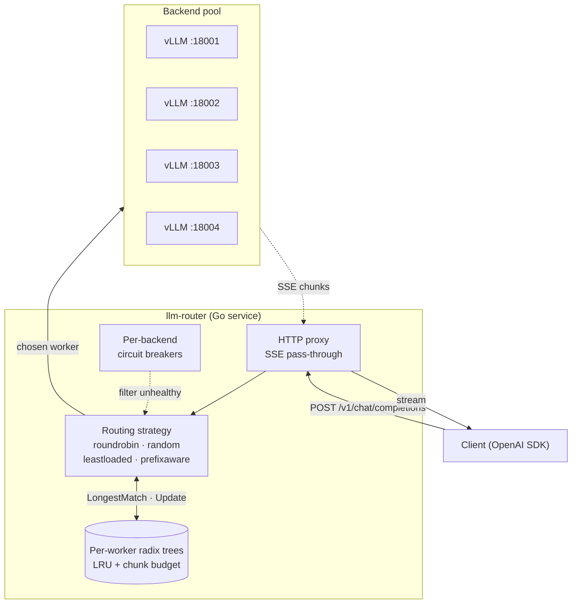
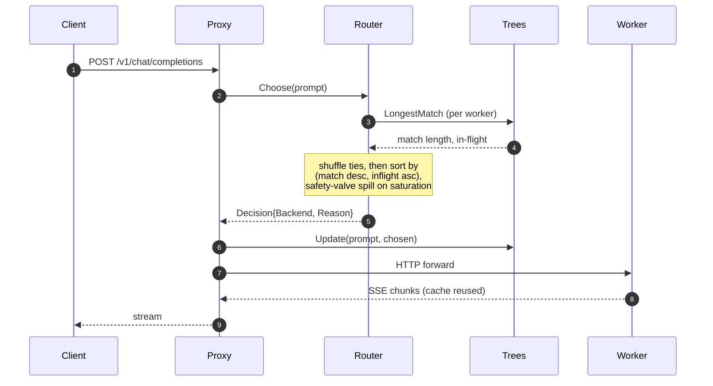

<div align="center">

# llm-router

**Cache-aware load balancer for OpenAI-compatible LLM servers, in Go.**

Routes each chat completion to the worker that already holds the request's
prefix in its KV cache, so the same prompt prefix is prefilled once across
the fleet rather than once per worker.

[](go.mod)
[](LICENSE)
[](https://github.com/zxuhan/llm-router/stargazers)
[](.github/workflows/ci.yml)
[](.github/workflows/ci.yml)
[](.github/workflows/ci.yml)
[](.golangci.yml)

[](https://github.com/vllm-project/vllm)
[](https://github.com/ggerganov/llama.cpp)
[](internal/metrics/metrics.go)

[Quickstart](#quickstart) · [Performance](#performance) · [Architecture](#architecture) · [Cloud reproduction](docs/cloud-bench.md)

</div>

<p align="center">
  
</p>

<p align="center"><sub>
4× A100 80GB SXM, vLLM 0.6.4 with prefix caching, three seeds per point.
Same algorithm at two model sizes; prefix-aware p50 grows by 16-25 ms across
6× concurrency increase, baselines grow by 31-98 ms.
</sub></p>

---

## What it does

`llm-router` sits in front of a pool of OpenAI-compatible inference servers
(vLLM, llama.cpp, mlx-lm, anything that speaks `/v1/chat/completions`) and
makes one decision per request: **which worker should handle this prompt?**
Modern agentic workloads share large prefixes (system prompts, tool
definitions, conversation history), and inference engines cache the KV
state of those prefixes per process. Routing the next request to whichever
worker already holds the longest matching prefix skips the prefill stage
on the upstream and keeps tail latency bounded as concurrency rises.

The router implements four strategies behind one interface
(`roundrobin`, `random`, `leastloaded`, `prefixaware`) so the comparison
is apples-to-apples; the `prefixaware` strategy is the one that exploits
KV-cache locality.

---

## Quickstart

### Local, ~15 minutes, no GPU

```bash
brew install llama.cpp        # or build from source

mkdir -p models
curl -L -o models/qwen2.5-1.5b.gguf \
  https://huggingface.co/Qwen/Qwen2.5-1.5B-Instruct-GGUF/resolve/main/qwen2.5-1.5b-instruct-q4_k_m.gguf

make build

MODEL=models/qwen2.5-1.5b.gguf WORKER_PORTS="8001 8002 8003" \
  RUNS=3 SESSIONS=6 TURNS=3 SYS_LEN=2048 SEED=17 \
  bash bench/scripts/real-llm.sh

cat bench/results/real.md
```

Local M1 produces 75% upstream cache rate and 30% p95 TTFT improvement
at this small scale; full breakdown in [`docs/results.md`](docs/results.md).

### Cloud reproduction of the hero chart, ~$15

Spin up a 4× A100 80GB SXM pod on RunPod (50 GB container disk is enough)
and SSH in, then:

```bash
git clone https://github.com/zxuhan/llm-router.git
cd llm-router
bash scripts/install-cloud.sh                       # Go + pinned vLLM
tmux new -s bench                                   # survives SSH disconnect
bash bench/scripts/full-bench.sh                    # 7B + 14B sweep, ~3.5 hr
# detach with Ctrl+b then d; reattach later: tmux attach -t bench
```

The runbook (terminate-vs-stop billing trap, port-collision diagnostics,
scp recipe, plot regeneration) is in
[`docs/cloud-bench.md`](docs/cloud-bench.md).

---

## Performance

All numbers are from the cloud sweep. Mean ± stddev across three seeds at
each concurrency point. Trace shape: 12-24 sessions, 8 turns each, 6 KB
shared system prompt, max_tokens=64.

### Qwen2.5-14B at sessions=24 (six sessions per worker)

| Strategy | KV cached | TTFT p50 | TTFT p95 | TTFT p99 | RPS |
| :--- | ---: | ---: | ---: | ---: | ---: |
| roundrobin   | 91.10% | 193 ms | 2.40 s | 2.72 s | 25.2 |
| random       | 90.69% | 265 ms | 2.36 s | 2.74 s | 23.4 |
| leastloaded  | 94.22% | 171 ms | 2.12 s | 2.29 s | 27.6 |
| **prefixaware** | **94.88%** | **166 ms** | **2.13 s** | **2.25 s** | 26.8 |

`prefixaware` wins p50 by 14% over round-robin and 37% over random, and
shaves 17% off the p99 vs round-robin. KV cache hit rate is 94-95% at
every concurrency level (the [hero chart](docs/hero-cloud.png) above
shows this at sessions=4..24).

### Slope under load

The single property that matters most for production SLAs: how much does
TTFT grow as concurrency rises from one session per worker to six?

| Strategy | 7B slope (sessions=4 → 24) | 14B slope (sessions=4 → 24) |
| :--- | ---: | ---: |
| Random            | +49 ms (97 → 146 ms) | +98 ms (167 → 265 ms) |
| Round-robin       | +31 ms (84 → 115 ms) | +36 ms (157 → 193 ms) |
| Least-loaded      | +36 ms (66 → 102 ms) | +49 ms (122 → 171 ms) |
| **Prefix-aware**  | **+16 ms (83 → 99 ms)** | **+25 ms (141 → 166 ms)** |

Prefix-aware degrades 2-3× more gently than every baseline at both model
sizes. The pattern is the same shape; the absolute magnitudes scale with
prefill cost.

### Where prefix-aware does not win

At one session per worker (`sessions=4`), `leastloaded` beats prefix-aware
by 17-19 ms on both models:

| Model | LL p50 | PA p50 | gap |
| :--- | ---: | ---: | ---: |
| Qwen2.5-7B  |  66 ms |  83 ms | LL +17 ms |
| Qwen2.5-14B | 122 ms | 141 ms | LL +19 ms |

With one session per worker, `leastloaded` accidentally distributes one
session per worker; the second turn naturally lands on the worker that
already cached turn one, so there is no need for prefix-aware logic. The
strategy's stricter pinning adds router overhead with no marginal benefit
at this regime. The crossover is around `sessions = N_workers + 1`; below
it cheap baselines suffice, above it prefix-aware leads.

### Caveats on the numbers

- **Three seeds is a small sample.** The error bars in the chart are ±1
  sample stddev; tight bootstrap CIs over the per-request distribution
  would shave the noisier points (notably `7B sessions=12`, where PA's
  p50 has a stddev of 13 ms vs the median's typical 1-9 ms).
- **One trace pattern.** The trace is multi-turn conversations with a
  fixed-length shared system prompt. Real production traffic mixes
  patterns (single-turn, branching tool loops, RAG-style varied prefixes)
  that may shift the crossover point.
- **vLLM 0.6.4 specifically.** Newer vLLM versions changed the prefix
  caching defaults; relative ordering should hold but absolute numbers
  may shift.
- **Hit rate of 56% at PA `sessions=24`, 14B**, looks low next to the
  96.88% at lower concurrency. This is the safety valve aggressively
  spilling away from saturated workers; the spill is what kept TTFT in
  the lead. Hit rate is an internal signal, not the optimization target.

Full per-concurrency tables for both models:
[`docs/results-cloud.md`](docs/results-cloud.md).

---

## Architecture



Each backend has its own compressed radix tree of recently-dispatched
prompt prefixes, hashed into 32-byte chunks. On each request the router
asks every tree for its longest leading-chunk match, randomizes ties,
sorts by `(match desc, inflight asc)`, and applies a saturation safety
valve before dispatch. Every routing decision is surfaced to the client
as `X-Router-Backend` and `X-Router-Reason` response headers.

| Strategy | Decision rule |
| :--- | :--- |
| `roundrobin` | rotation counter |
| `random` | uniform random |
| `leastloaded` | minimum in-flight count |
| `prefixaware` | longest prefix match (ties broken by random shuffle), with a saturation valve that spills off workers above `inflight ≥ saturation_inflight` |

A single request:



Package layout, concurrency model, and the full list of emitted Prometheus
metrics: [`docs/architecture.md`](docs/architecture.md). Eight ADRs
covering language choice, backend abstraction, prefix tree design, LRU
eviction, the safety valve, tokenization, the circuit breaker, and tie-break
randomization: [`docs/decisions/`](docs/decisions/).

---

## Limitations

In rough order of how much they would change the result if addressed:

- **Bootstrap CIs over the per-request distribution** would replace the
  current ±1 sample-stddev error bars (computed from three seeds). With
  only three seeds, an outlier seed visibly distorts a few points.
- **Tokenizer-backed chunker** would replace the current 32-byte hash
  chunks ([ADR 0006](docs/decisions/0006-tokenization-strategy.md)). Hash
  chunks are model-agnostic and cheap, but chunk boundaries can split
  tokens; a real tokenizer would tighten the longest-match calculation.
- **Auto-tuned `saturation_inflight`** based on observed per-worker p95
  latency would remove the only routing knob that currently needs manual
  setting per workload. Today's default of 4 is calibrated for our trace
  shape; a different concurrency profile may want a different threshold.
- **SGLang RadixAttention as an upstream baseline.** The current bench
  compares four routing strategies against the same vLLM upstream. A
  comparison against SGLang's engine-level cache-aware scheduling would
  separate the routing-layer contribution from the engine-layer one.
- **Multi-trace bench.** The current trace is one shape (multi-turn with
  shared system prompt); real production mixes single-turn, RAG, and
  branching tool loops.
- **Half-open one-probe circuit breaker.** Today's breaker is closed/open
  with a fixed cooldown ([ADR 0007](docs/decisions/0007-circuit-breaker.md));
  a half-open probe would shorten recovery from a flaky backend.
- **Admin endpoint for draining a backend** (`POST /admin/drain?backend=w0`)
  is missing; today's only out is to remove the worker from config and
  hot-reload.

---

## References

- **[SGLang: Efficient Execution of Structured Language Model Programs](https://arxiv.org/abs/2312.07104)** (Zheng et al., 2023). RadixAttention, the engine-level prefix caching this project demonstrates at the routing layer.
- **[Efficient Memory Management for Large Language Model Serving with PagedAttention](https://arxiv.org/abs/2309.06180)** (Kwon et al., 2023). The vLLM paper; the upstream whose prefix caching and `prompt_tokens_details.cached_tokens` we read from.
- **[Mooncake: A KVCache-centric Disaggregated Architecture for LLM Serving](https://arxiv.org/abs/2407.00079)** (Qin et al., 2024). Production-scale precedent for cache-aware request scheduling across an inference fleet.
