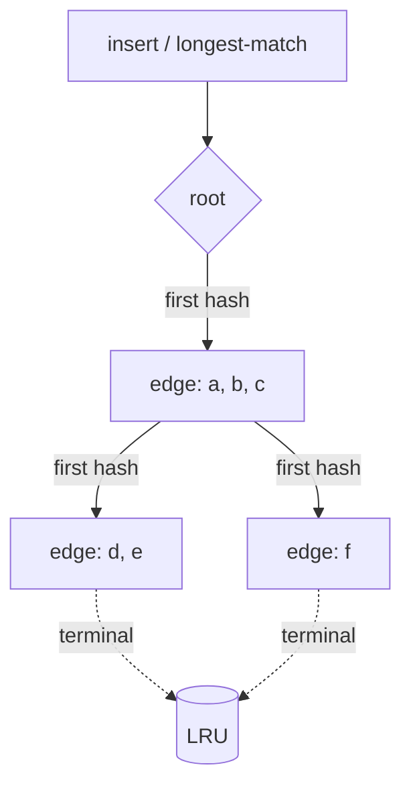

# Architecture

This document describes the internals of the prefix-cache aware router. It is
the companion to `README.md`: the README states the thesis and shows the
quickstart, this document explains how the system is put together.

## Top-level picture

```text
                        +---------------------+
   client --POST-->     | router (Go service) | --HTTP/SSE--> worker A (llama.cpp)
   /v1/chat/completions |  - prompt extract   |
                        |  - strategy.Choose  | --HTTP/SSE--> worker B (llama.cpp)
                        |  - tree.Update      |
                        |  - SSE pass-through | --HTTP/SSE--> worker C (mlx-lm.server)
                        +---------------------+
                                 |
                                 +-- /metrics  (prometheus)
                                 +-- /healthz
```

The router speaks the OpenAI `/v1/chat/completions` API to clients and the
same wire format upstream. Any backend that ships an OpenAI-compatible
endpoint can stand in: llama.cpp's built-in server, mlx-lm.server, vLLM,
text-generation-inference, etc.

## Package layout

```text
cmd/
  router/      main entry point: loads config, wires components, runs servers
  replay/      fires a JSONL trace at a running router
  gen-traces/  emits a deterministic synthetic trace
  bench/       in-process benchmark across all strategies (no external workers)

internal/
  config/      yaml + env config with strict validation
  backend/     Backend interface, llama.cpp HTTP client, FakeServer for tests
  prefixtree/  concurrent radix tree with LRU eviction
  router/      Router interface and strategy implementations
  proxy/       HTTP handler: prompt extract, route, dispatch, stream, observe
  metrics/     Prometheus registry + Recorder adapter + tree collector
  logging/     slog wrapper, request IDs, AccessLogRecorder
  trace/       trace generator, replayer, summary report writer
  integration/ end-to-end tests across the whole stack
```

The dependency graph is unidirectional:
`config` and `backend` are leaves; `prefixtree` is independent;
`router` depends on `backend` and `prefixtree`; `proxy` depends on `router` and
`backend`; `metrics` and `logging` depend on `proxy` (for the `Recorder`
type); `trace` depends on nothing internal beyond its own package; `cmd/*`
glues these together.

## Request lifecycle

```mermaid
sequenceDiagram
    autonumber
    participant Client
    participant Proxy as proxy.Handler
    participant Router as router.Router
    participant Tree as prefixtree.Tree (per worker)
    participant Backend as backend.Backend (chosen)

    Client->>Proxy: POST /v1/chat/completions (body)
    Proxy->>Proxy: read body, extract prompt string
    Proxy->>Router: Choose(ctx, prompt)
    Router->>Tree: LongestMatch(chunks)  (for each backend)
    Tree-->>Router: match length per backend
    Router-->>Proxy: Decision{Backend, MatchChunks, Reason}

    Proxy->>Tree: Update(prompt, chosen)  (writes the chunks into chosen worker tree)
    Proxy->>Backend: Acquire(); Do(ctx, request)
    Backend-->>Proxy: HTTP response (status + headers)
    Proxy-->>Client: status + headers (incl. X-Router-Backend, X-Router-Reason)
    loop streaming body
        Backend-->>Proxy: SSE chunk
        Proxy-->>Client: SSE chunk (Flusher.Flush)
    end
    Backend-->>Proxy: EOF
    Proxy->>Backend: Release()
    Proxy->>Proxy: emit RequestStats to Recorder(s)
```

The two important properties to notice:

1. **`Update` happens before `Do`**. We intentionally insert into the tree
   *before* dispatching, so that near-simultaneous requests with the same
   shared prefix all see the same "this worker now holds it" hint and pin
   to the same worker. The cost of a wrong update (because dispatch failed)
   is at most one cold start later. See ADR 0005 for the trade-off.
2. **The proxy never buffers the body**. SSE chunks are flushed as they
   arrive; TTFT is recorded on the first non-zero `Read` from the upstream
   body.

## The prefix tree

`internal/prefixtree.Tree` is a compressed radix tree over `[]uint64`. Each
`uint64` is the FNV-1a hash of a fixed-size byte chunk of the prompt. The
chunk size is configurable; 32 bytes is the default.

Why hashing chunks instead of running a real tokenizer:

- Tokenizers are model-specific. A router that ships in front of a fleet of
  heterogeneous workers cannot assume one tokenizer.
- Prefix-cache hits in vLLM/llama.cpp/SGLang are byte-identical at the token
  level, so any function that is monotone with the byte prefix is correct
  for routing decisions; FNV-on-chunks is a deterministic, dependency-free
  approximation. See ADR 0006.

The tree supports:

- `Insert(seq)` walks down splitting edges as needed. `O(L)` in the prompt
  length where `L` is the chunk count. Marks a terminal node.
- `LongestMatch(seq)` walks down as far as it can, returning the matched
  chunk count. Read-locked; multiple `LongestMatch` calls run concurrently.
- LRU eviction: every terminal node sits on a `container/list` LRU keyed by
  insertion/touch time. When `Insert` pushes the chunk count above
  `MaxChunks`, the oldest terminal is evicted and dead branches are pruned
  upward.



## The routing strategies

All strategies implement `router.Router`:

```go
type Router interface {
    Name() string
    Choose(ctx, prompt) (Decision, error)
    Update(prompt, chosen)
}
```

- **RoundRobin**: atomic counter modulo backend count.
- **Random**: `math/rand/v2.IntN(n)` per request.
- **LeastLoaded**: pick the backend with the lowest `Inflight()`.
- **PrefixAware**: ask each backend's tree for `LongestMatch`. Pick the
  backend with the longest match if it meets `MinMatchChunks`; otherwise
  fall back to the configured fallback (default `LeastLoaded`). If the best
  worker is at or above `SaturationInflight`, the safety valve spills to
  the next-best match; if no alternative qualifies, it spills to the
  fallback. See ADR 0005.

Decisions carry a `Reason` field that is surfaced both in the `X-Router-Reason`
response header and in the Prometheus `reason` label, so operators can see
each decision class without instrumentation overhead.

## Metrics

The `internal/metrics` package owns a private `prometheus.Registry`, four
labelled instruments, and a custom `Collector` that snapshots prefix-tree
state on every scrape. It returns a `proxy.Recorder` so the proxy stays
ignorant of Prometheus.

| Metric | Type | Labels |
| --- | --- | --- |
| `router_requests_total` | counter | strategy, backend, reason, status |
| `router_response_bytes_total` | counter | strategy, backend |
| `router_request_duration_seconds` | histogram | strategy, backend, reason |
| `router_time_to_first_byte_seconds` | histogram | strategy, backend, reason |
| `router_prefix_match_chunks` | histogram | strategy, backend |
| `router_cache_hit_requests_total` | counter | strategy, backend, category |
| `router_prefix_tree_chunks` | gauge | backend |
| `router_prefix_tree_terminals` | gauge | backend |
| `router_prefix_tree_max_chunks` | gauge | backend |
| `router_prefix_tree_inserts_total` | counter | backend |
| `router_prefix_tree_queries_total` | counter | backend |
| `router_prefix_tree_evictions_total` | counter | backend |

`status` is bucketed (`2xx`, `4xx`, `5xx`, ...) to avoid label-cardinality
explosion on misbehaving upstreams.

## Concurrency model

- One `prefixtree.Tree` per worker, each protected by its own `sync.RWMutex`.
- `LongestMatch` takes the read lock; `Insert` and eviction take the write
  lock. The diagnostic counters (`inserts`, `queries`, `evicted`) are
  `atomic.Uint64` so they can be bumped under the read lock.
- Backend `Inflight()` is an `atomic.Int64`. `Acquire`/`Release` are CAS-loop
  style so over-release clamps at zero rather than going negative.
- The proxy does not maintain its own request-level locking; everything is
  request-scoped and the underlying Go HTTP server gives us one goroutine
  per request.

The full test suite runs with `-race` in CI. The fuzz tests in
`internal/prefixtree` cross-check against a brute-force oracle to catch
correctness regressions during refactors.
