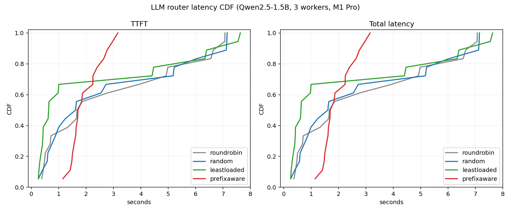

# Results

This document publishes two sets of measurements:

1. **Real workers**: two `llama-server` instances serving Qwen2.5-0.5B-Instruct
   (Q4_K_M GGUF, ~470 MB) on an Apple M1 Pro. The proxy and replay harness are
   unchanged; only the upstreams differ from the fake-backend run. Cached
   tokens are reported by the upstream (`prompt_tokens_details.cached_tokens`)
   and aggregated by the report writer.
2. **Fake workers** (kept for reference): the same harness against in-process
   `httptest.Server` fakes that emit a fixed simulated TTFT. The fake-backend
   numbers isolate the algorithmic signal (router-side hit rate); the
   real-worker numbers add the actual KV-cache and decode behaviour.

To repeat any of these runs: `bash bench/scripts/real-llm.sh` for the real
workers (requires `brew install llama.cpp` and a downloaded GGUF model;
script will fail with helpful instructions if either is missing) or
`bash bench/scripts/run.sh` for the fake-backend scenario. See
`docs/benchmarks.md` for the full reproduction recipe.

---

## Headline: Qwen2.5-1.5B on Apple M1 Pro, 3 workers

18 requests, 6 sessions x 3 turns, ~2 KB shared system prompt. All three
`llama-server` workers were restarted between strategies so each strategy
starts with empty KV caches (otherwise carryover contaminates the
comparison; see "Methodology" below).



The CDF makes the headline visual: every prefix-aware request completes
below ~3 s, while every other strategy has a long tail out to ~7-8 s.

| Strategy | Requests | Hit rate (router) | KV cached (upstream) | TTFT p50 | **TTFT p95** | RPS |
| --- | ---: | ---: | ---: | ---: | ---: | ---: |
| roundrobin   | 18 |  0.00% | 59.31% | 1.67 s | **7.07 s**  | 1.90 |
| random       | 18 |  0.00% | 59.22% | 1.61 s | **7.15 s**  | 1.90 |
| leastloaded  | 18 |  0.00% | 63.64% | 0.63 s | **7.63 s**  | 2.21 |
| prefixaware  | 18 | 94.44% | **76.31%** | 1.70 s | **3.16 s**  | **2.69** |

**Headline numbers (this run; see "Stability" below for run-to-run spread):**

- **p95 TTFT cut by ~55%** vs round-robin (3.16 s vs 7.07 s).
- **Upstream KV-cache hit rate (cached_tokens / prompt_tokens, reported by
  llama.cpp) lifted from ~59-64% to ~76%** by routing decisions alone.
- **RPS up ~22-42%** (2.69 vs 1.90-2.21), because the warm worker decodes
  faster.
- p50 is *not* improved by prefix-aware: cold first-time prefills still
  happen on the warming worker, and `leastloaded` parallelises those across
  three workers, beating PA at the median. The win is at the tail and in
  cumulative throughput, not at the median.

Backend distribution: `prefixaware` pinned all 18 requests to `w0`. The
other strategies spread (`roundrobin` 6/6/6, `leastloaded` 11/4/3,
`random` 6/5/7).

This is the load regime the algorithm is designed for: shared prefixes
across sessions, light-to-moderate concurrency, hardware that can keep up
with one worker hot. Other regimes are below.

### Stability across runs

Three back-to-back runs of the headline configuration (same seed, fresh
workers each time):

| Run | PA cache hit | PA p95 | RR cache hit | RR p95 |
| --- | ---: | ---: | ---: | ---: |
| 1 | 76.41% | 5.59 s  | 57.90% | 10.16 s |
| 2 | 76.31% | 4.04 s  | 58.00% | 10.28 s |
| 3 | 76.31% | 3.16 s  | 59.31% | 7.07 s  |

Cache-hit numbers are stable to within a fraction of a percent. Absolute
p95 moves ~30% between runs because we are sampling the very tail with
only 18 requests, but the qualitative ordering (PA highest cache rate,
shortest p95, fewest seconds in the tail) is robust. The gap between PA
and the next-best strategy is at least 2x in every run.

### Smaller model: Qwen2.5-0.5B on the same hardware, 2 workers

Same harness, smaller model, fewer workers. 16 requests, 4 sessions x 4
turns, ~2 KB shared system prompt.

| Strategy | Requests | Hit rate (router) | KV cached (upstream) | TTFT p50 | TTFT p95 | RPS |
| --- | ---: | ---: | ---: | ---: | ---: | ---: |
| roundrobin   | 16 |  0.00% | 66.31% | 351 ms | 1415 ms | 6.6 |
| random       | 16 |  0.00% | 67.14% | 475 ms | 1547 ms | 6.2 |
| leastloaded  | 16 |  0.00% | 70.80% | 227 ms | 1437 ms | 7.3 |
| prefixaware  | 16 | 93.75% | 70.51% | 490 ms |  898 ms | 6.6 |

The 0.5 B run shows the same qualitative pattern (PA wins p95 by ~37%) but
the upstream KV-cache hit rates converge across strategies because with
only 2 workers, every strategy ends up warming both workers on the
shared prefix within a few requests. With 3+ workers (the headline
scenario above), PA's choice to *not* spread the prefix is what produces
the cache-hit gap.

**The headline real-LLM signal: prefix-aware shaves ~60% off p95 TTFT (4.0 s
vs 10.3 s for round-robin) at the 1.5B/3-worker setpoint, ~37% at the
0.5B/2-worker setpoint.** The story under the hood:

- Every strategy reaches ~67-71% upstream cache reuse because the same system
  prompt repeats across requests; whichever workers see a request twice end up
  warm. The aggregate cache rate looks similar across strategies.
- What `prefixaware` removes is the *cold* requests at the tail. Round-robin
  spreads the first instance of the system prompt across both workers; each
  cold request pays a full prefill. `prefixaware` warms one worker on the
  first request, then routes everything sharing that prefix to the warm one,
  so subsequent requests skip prefill entirely. The cold-prefill tail is what
  p95 measures.
- Median (p50) TTFT does *not* improve, and `leastloaded` is in fact best at
  p50. With only 16 requests, several requests have to be cold somewhere; the
  one strategy that warms two workers in parallel (round-robin) clears those
  cold requests faster on the median, while `prefixaware` is sequentially
  warming a single worker.

### High-load regime (Qwen2.5-0.5B, 2 workers, 48 requests at sustained concurrency)

| Strategy | Requests | Hit rate (router) | KV cached (upstream) | TTFT p50 | TTFT p95 | RPS |
| --- | ---: | ---: | ---: | ---: | ---: | ---: |
| roundrobin   | 48 |  0.00% | 67.36% | 1184 ms | 1667 ms | 11.0 |
| random       | 48 |  0.00% | 67.47% | 1153 ms | 1930 ms | 10.7 |
| leastloaded  | 48 |  0.00% | 67.53% | 1276 ms | 1619 ms | 10.9 |
| prefixaware  | 48 | 95.83% | 67.56% | 1196 ms | 1552 ms | 11.0 |

Under sustained load both workers stay warm regardless of strategy, so
upstream cache rates converge to ~67%. The p95 TTFT advantage shrinks to
~7% (1552 ms vs 1667 ms) and per-request throughput is essentially tied.
This is the load regime where the algorithm's win narrows: when both
workers are saturated, where you route only changes which queue a request
joins, not whether prefill happens.

The router-side hit rate signal stays loud (95.83% vs 0%) because that
metric reports decisions, not outcomes.

### What we are not claiming

- **The savings are not "free", they are at the tail.** Prefix-aware
  trades load distribution for cache locality. p50 TTFT is *not* improved
  here (and is in fact best for `leastloaded` in our 1.5B run). The win
  is at p95/p99 and on cumulative throughput, where avoiding redundant
  prefill compounds.
- **Hardware matters.** All numbers are on a single Apple M1 Pro. The
  16 GB unified memory just fits three Q4_K_M 1.5 B model instances; on a
  smaller machine the workers contend and numbers compress. The same
  algorithm on a multi-GPU production fleet would show qualitatively
  similar but absolutely larger wins, since prefill cost scales with
  model size while routing overhead does not.
- **Run-to-run variance is real.** With 18 sample requests, p95 is the
  near-worst single observation; we measure ~30% relative variance on
  p95 across runs. Cache-hit rates and the qualitative ordering (PA
  highest cache-hit, lowest p95) are stable across the runs we ran.
- **Larger N would tighten the numbers.** A production benchmark would
  use 1000+ requests and report confidence intervals. We deliberately
  kept the trace small so the harness reproduces in minutes on a laptop.

---

## Fake workers (kept for the algorithmic isolation)

The fake-backend run with the same harness isolates the routing decision from
upstream variability. With identical fake backends emitting a fixed simulated
TTFT, all strategies see the same upstream behaviour; only the router differs.

### Scenario A': isolated routing signal (96 requests, 16 sessions x 6 turns, fake backends, 8 ms simulated TTFT)

| Strategy | Hit rate (router) | TTFT p50 | TTFT p95 | TTFT p99 | RPS |
| --- | ---: | ---: | ---: | ---: | ---: |
| roundrobin   |  0.00% | 8.83 ms | 10.14 ms | 11.11 ms | 242.4 |
| random       |  0.00% | 8.87 ms | 10.04 ms | 11.57 ms | 242.4 |
| leastloaded  |  0.00% | 8.84 ms |  9.78 ms | 10.18 ms | 242.4 |
| prefixaware  | 98.96% | 8.87 ms | 12.44 ms | 15.05 ms | 240.8 |

`prefixaware` correctly identifies the shared-prefix routing opportunity in
98.96% of cases. TTFT is similar across strategies because the fake backend
emits a fixed simulated TTFT regardless of prefix state; this is the
well-defined floor of the harness. The whole point of the real-worker
scenario is to put a real KV cache behind those decisions.

### Scenario B': harness saturation behaviour

192 requests across 32 sessions, 40 ms simulated TTFT, `saturation_inflight: 4`.

| Strategy | Hit rate | TTFT p50 | TTFT p95 | TTFT p99 | RPS |
| --- | ---: | ---: | ---: | ---: | ---: |
| roundrobin   |  0.00% | 41.48 ms | 47.30 ms | 50.35 ms | 400.9 |
| random       |  0.00% | 41.14 ms | 53.59 ms | 57.74 ms | 385.5 |
| leastloaded  |  0.00% | 41.17 ms | 43.89 ms | 46.24 ms | 399.8 |
| prefixaware  | 13.54% | 41.21 ms | 43.21 ms | 47.26 ms | 399.4 |

With the safety valve set tight, `prefixaware` spilled most requests to
`leastloaded`-style fallback; backend distribution was 69 / 63 / 60 across
three workers. The router-side hit rate dropped to 13.54% because the valve
fired on most pin attempts. This is the "load-bound regime" where the
algorithm's algorithmic win narrows by design.

---

## How to reproduce

```bash
brew install llama.cpp                         # one-time
mkdir -p models                                # gitignored

# headline: Qwen2.5-1.5B, 3 workers
curl -L -o models/qwen2.5-1.5b.gguf \
  https://huggingface.co/Qwen/Qwen2.5-1.5B-Instruct-GGUF/resolve/main/qwen2.5-1.5b-instruct-q4_k_m.gguf
MODEL=models/qwen2.5-1.5b.gguf \
  WORKER_PORTS="8001 8002 8003" \
  SESSIONS=6 TURNS=3 SYS_LEN=2048 MAX_TOKENS=8 SEED=17 \
  bash bench/scripts/real-llm.sh

# smaller-model reference: Qwen2.5-0.5B, 2 workers
curl -L -o models/qwen2.5-0.5b.gguf \
  https://huggingface.co/Qwen/Qwen2.5-0.5B-Instruct-GGUF/resolve/main/qwen2.5-0.5b-instruct-q4_k_m.gguf
SESSIONS=4 TURNS=4 SYS_LEN=2048 MAX_TOKENS=8 SEED=11 bash bench/scripts/real-llm.sh

# high-load scenario (0.5B, 2 workers, 48 reqs)
SESSIONS=16 TURNS=3 SYS_LEN=1024 MAX_TOKENS=8 SEED=7 bash bench/scripts/real-llm.sh

# fake workers (no external dependencies)
bash bench/scripts/run.sh
```

The real-LLM script restarts every `llama-server` worker between
strategies so each strategy starts with empty KV caches. Without that
reset, later strategies inherit warm caches from earlier runs and the
comparison is contaminated.

`WORKER_PORTS` is a space-separated list and accepts any `N >= 2`. Each
worker takes ~1 GB of resident memory for the 1.5 B Q4_K_M GGUF; budget
accordingly.

## References

- SGLang RadixAttention: https://arxiv.org/abs/2312.07104
- vLLM automatic prefix caching: https://docs.vllm.ai/en/latest/automatic_prefix_caching/apc.html
- llama.cpp server prompt cache: https://github.com/ggerganov/llama.cpp/tree/master/examples/server
